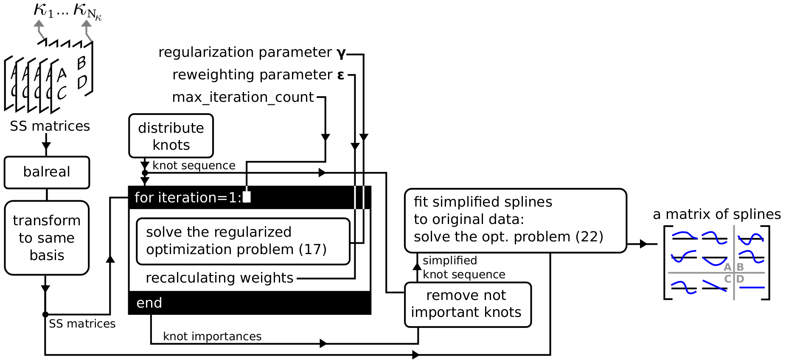

# ReSMILE

A toolbox for LPV system indentification using the Regularized State-space Model Interpolation of Local Estimates (ReSMILE).

## Installing & requirements

- MathWorks MATLAB (Tested versions: R2019b on GNU/Linux, R2020a on Windows 10)
- MathWorks Control System Toolbox for MATLAB
- [OptiSpline release v0.1](https://github.com/meco-group/optispline/releases/tag/v0.1) package contains both OptiSpline and CasADi, and is used to formulate and solve optimization problems involving B-splines
- [YALMIP R20200116](https://github.com/yalmip/YALMIP/releases/tag/R20200116) is used by OptiSpline to parse optimization problems involving B-splines
- [Mosek 8.0.0.60](https://www.mosek.com/downloads/8.0.0.60/) is used as the solver for SOCP problems
- [LC Toolbox](https://github.com/meco-group/lc_toolbox), commit `778d5c604909ccb98f245ed5c619e73971d9205a` (optional but recommended) can be used to work with the results of the ReSMILE, contains LPV control design routines

From the root of the repo / release ZIP file, you need to add the following directories to path (or run `resmile_mkpath.m` to do it):

```
addpath('.','examples','lib','datasets')
```

Download all prerequisites to a folder, and also clone this repo into it.  
A script that you can use to add prequisites to path and check that they work:

```octave
addpath(genpath('yalmip'))                          % Add YALMIP to path
addpath('C:\Program Files\Mosek\8\toolbox\r2014a')  % Add Mosek to path
addpath('optispline')                               % Add optispline to path
addpath(genpath('lc_toolbox'))                      % Add LCToolbox to path
cd resmile                                          % We assume that the ReSMILE is in a subdirectory "resmile"
resmile_mkpath                                      % Add ReSMILE to path
cd ..                                               % Go back to previous directory
ss                                                  % Test for Control System Toolbox, should print "Empty state-space model."
mosekdiag                                           % Test for Mosek, should print "mosekopt is working correctly." in the last line
casadi.MX                                           % Test for CasADi, should print "0x0" if CasADi is working correctly
sdpvar                                              % Test for YALMIP, should print "Linear scalar (real, 1 variable)" in the first line
IOSystem                                            % Test for LCToolbox, should not print anything, should run without an error.
```

## Quickstart

We want to create a B-spline interpolated model of an overhead crane with a low amount of knots. 

Load state-space models coresponding to an overhead crane:

```octave
rsm = Resmile(Resmile.dataset_oc); 
```

Bring these state-space models to the same basis:

```octave
rsm.make_coherent
```

Create a B-spline interpolated model from the state-space matrices, and figure out which knots to remove:

```octave
rsm.fit_resmile
```

Create simplified model, prepare for plotting (analyze step) and plot the splines:

```octave
rsm.simplify
rsm.analyze
rsm.plot(Resmile.PL_TABS_SPLINES)
```

Plot the FRFs:
```octave
rsm.plot(Resmile.PL_TABS_FRF)
```

## Paper <a name="isma2020" />

We have published a paper on the topic, which is available in the ISMA 2020 preliminary proceedings.  
You can find the related example code in `examples/isma2020_examples.m`.  
The paper also references to other scripts in the `examples` directory.  

<!--
How to cite the toolbox:

```bibtex
@inproceedings{resmile_isma2020,
  author={András Retzler and Jan Swevers and Joris Gillis and Zsolt Kollár},
  booktitle={Proceedings of ISMA2020 and USD2020}, 
  title={{ReSMILE}: trading off model accuracy and complexity for linear parameter-varying systems}, 
  year={2020},
  pages={}
}
```
-->

Some things explained in the paper: why to use B-spline based LPV models, background on B-splines (formal definition and how to imagine them), background on the formulas behind ReSMILE and how they were developed.

## Suggested identification workflow

1. Estimate state-space LTI models for a selected set of scheduling parameter values (using either LCToolbox or the MathWorks System Identification Toolbox).
2. Supply the input data to the LCToolbox in the appropriate format using set input or the `Resmile` class constructor.
3. In case of a black box model, apply `make_coherent` to bring the state-space models into a coherent basis. Skip this step for a white box model.
4. Apply `fit_resmile` with the default parameters. 
5. Apply `simplify` to remove knots and to create a simplified LPV model.
6. Check errors (`analyze`) and graphs (`plot`) to evaluate the quality of the result.
7. Check if the correct splines are auto-detected as straight lines using `spline_remover_info`.
8. If not satisfied with model accuracy/simplicity: change `gamma`, and rerun from step 4 until satisfied.
9. If still not satisfied, adjust `epsilon` and `knot_removal_threshold`, and rerun from step 4.
10. If still not satisfied, change the initial distribution of knots (`knots_distribute_mode`), and rerun from step 4.
11. Export model to LCToolbox `LPVDSSmod` object using `simplified_ssmod`, to use for control design.

## ReSMILE algorithm overview



## License

This project is licensed under LGPLv3, except for `lib/gif.m` which is available under the 2-BSD license.
